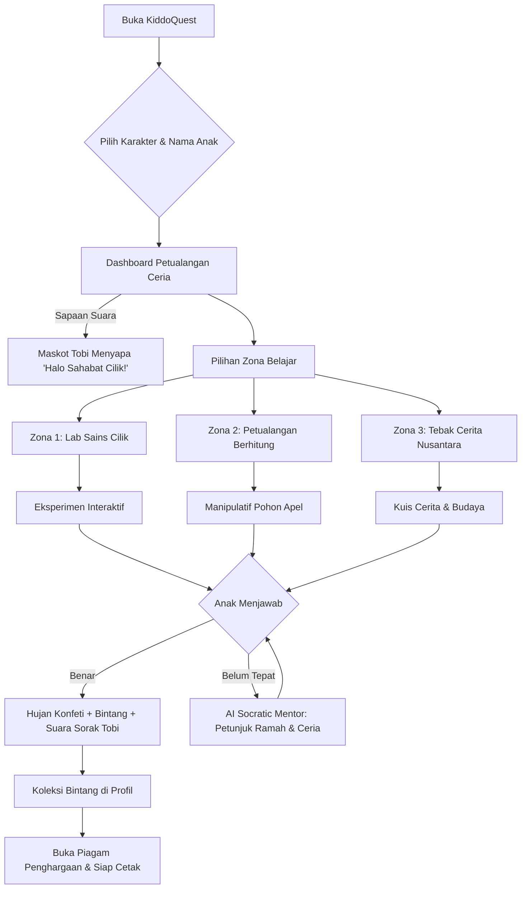

# Product Requirements Document (PRD)
## KiddoQuest - Platform Edukasi Interaktif Siswa SD
**Kategori Lomba:** M-ONE Telkomsel Coding Competition  
**Tema:** Innovating Education Through Technology  
**Subtema:** Web Education for Kids (SD)  
**Versi Dokumen:** 1.0.0 (Tahap 1 - Arsitektur & Fondasi)  
**Status:** Approved & In Development  

---

## 1. Executive Summary & Visi Produk

**KiddoQuest** adalah platform web pembelajaran interaktif masa depan yang dirancang khusus untuk siswa Sekolah Dasar (SD Kelas 1–6) di seluruh Indonesia. Mengusung semangat inovasi Telkomsel untuk pemerataan pendidikan digital berkualitas (*Inclusive & Accessible EdTech*), KiddoQuest memadukan:
- **Gamifikasi Pembelajaran Menyenangkan (Joyful Learning):** Mengubah materi sains, matematika, dan literasi menjadi petualangan visual manipulatif.
- **Dukungan Audio & Suara Inklusif:** Terintegrasi dengan Web Speech API untuk membacakan teks (*Text-to-Speech*) bagi anak yang baru belajar membaca atau anak dengan gaya belajar auditori.
- **AI Socratic Kids Mentor ("Tobi si Robot Sahabat"):** Memberikan bimbingan ramah dan kalimat pemantik pemikiran (*Socratic method*) ketika anak salah menjawab, menghapus rasa takut gagal (*fear of failure*).
- **Arsitektur Zero-Crash & LocalStorage-First:** Tidak bergantung pada server database berat, instan dimuat, aman bagi privasi anak, serta dilengkapi **Mode Telkomsel Lite (< 500 KB)** untuk sekolah dan anak di wilayah 3T (*Terdepan, Terluar, Tertinggal*).

---

## 2. Problem Statement (Latar Belakang Masalah)

1. **Digital Fatigue & Materi Kaku:** Sebagian besar platform e-learning SD berupa bank soal PDF atau video pasif satu arah yang membosankan dan memicu kelelahan layar (*screen fatigue*) tanpa interaksi kinestetik.
2. **Kesenjangan Kemampuan Membaca (Literasi Dini):** Siswa kelas 1–2 SD sering tertinggal dalam memahami instruksi digital karena keterbatasan membaca teks panjang tanpa bantuan pendampingan suara manusia.
3. **Keterbatasan Kuota & Sinyal di Daerah Pelosok:** Aplikasi pembelajaran komersial berbasis video streaming berukuran gigabyte membebani kuota orang tua dan tidak dapat dibuka di jaringan 3G/EDGE atau sinyal lemah.
4. **Hukuman Visual Menakutkan (Fear of Making Mistakes):** Kuis edukasi konvensional sering menampilkan tanda silang merah besar disertai bunyi buzzer yang menurunkan rasa percaya diri anak. Dibutuhkan respon sokratik suportif yang membimbing proses berpikir anak.

---

## 3. Target Persona

| Persona | Profil | Kebutuhan Utama | Solusi di KiddoQuest |
| :--- | :--- | :--- | :--- |
| **Budi (7 Thn)** | Siswa Kelas 1 SD, belum lancar membaca kalimat panjang. | Membutuhkan tombol besar, visual warna-warni, serta bantuan suara yang membacakan instruksi. | Audio narator Tobi (Text-to-Speech), manipulatif hitung apel visual, navigasi ikonik intuitif. |
| **Siti (10 Thn)** | Siswa Kelas 4 SD, aktif, penasaran dengan eksperimen alam. | Ingin mencoba simulasi sains tanpa takut salah atau bahaya fisik. | Lab Sains Cilik (campur cairan warna, siklus air & hujan interaktif realtime). |
| **Ibu Rahma (34 Thn)** | Guru Kelas 2 SD / Orang Tua di daerah sub-urban. | Membutuhkan media ajar gratis tanpa login ribet, hemat kuota internet, dan ada laporan capaian anak. | Zero-login / Instant Play, Mode Telkomsel Lite (< 500 KB), serta Cetak Piagam Prestasi otomatis. |

---

## 4. Arsitektur Teknis & Tech Stack

```
+-------------------------------------------------------------------------+
|                              KiddoQuest UI                              |
|   (Next.js App Router, Tailwind CSS 4, Lucide Icons, Chunky Kids UI)    |
+-------------------------------------------------------------------------+
                                    |
     +------------------------------+-------------------------------+
     |                              |                               |
     v                              v                               v
+------------------+     +--------------------+          +------------------+
|   Audio Engine   |     | Socratic AI Mentor |          |  Storage & State |
|  Web Speech API  |     |  Feedback Logic    |          | LocalStorage     |
| (Bahasa ID TTS)  |     | (Positive Prompts) |          | (Zero-Crash sync)|
+------------------+     +--------------------+          +------------------+
     |                              |                               |
     +------------------------------+-------------------------------+
                                    |
                                    v
+-------------------------------------------------------------------------+
|                  Zona Pembelajaran & Modul Spesial                      |
| - Lab Sains Cilik (Color Mixing & Water Cycle)                         |
| - Petualangan Berhitung (Math Manipulatives Apel)                       |
| - Cerita & Tebak Kata Nusantara (Literasi Gambar)                       |
| - Telkomsel Lite Mode Optimizer (< 500 KB toggle)                       |
| - Piagam Penghargaan Otomatis (Print / PDF Ready)                       |
+-------------------------------------------------------------------------+
```

### Rincian Teknologi:
- **Framework:** Next.js 15+ (App Router) dengan TypeScript
- **Styling:** Tailwind CSS dengan palet warna ceria, border tebal 3D, and soft rounded curves (`rounded-3xl`)
- **Speech Synthesis:** HTML5 Web Speech API (`window.speechSynthesis`) dengan aksen Bahasa Indonesia yang ramah anak.
- **State Persistence:** LocalStorage Manager dengan schema versioning & fallback aman (Zero-Crash Guarantee).
- **Gamifikasi:** Custom Canvas Confetti & Reactive Badge Rewards.
- **Performa:** Telkomsel Lite Mode yang mematikan aset berat, mengaktifkan high-contrast accessibility, dan membatasi ukuran transfer data di bawah 500 KB.

---

## 5. Zona Pembelajaran Utama (Features)

### 5.1. Lab Sains Cilik (Eksperimen Interaktif)
- **Eksperimen 1: Pencampuran Warna Primer ke Sekunder:**
  - Tabung reaksi interaktif: Anak memilih warna Merah, Kuning, atau Biru.
  - Efek pencampuran dinamis: Merah + Kuning = Oranye, Biru + Kuning = Hijau, Merah + Biru = Ungu.
  - Penjelasan sains sederhana dipandu suara Tobi si Robot.
- **Eksperimen 2: Siklus Air & Hujan Ajaib:**
  - Slider interaktif suhu matahari & awan.
  - Anak melihat proses Evaporasi (penguapan air laut) -> Kondensasi (pembentukan awan) -> Presipitasi (hujan turun menyirami pohon).

### 5.2. Petualangan Berhitung Ceria (Manipulatif Matematika)
- Pohon Apel Ajaib: Memvisualisasikan soal penjumlahan & pengurangan.
- Interaksi Sentuhan: Anak memetik apel dari pohon dan memasukkannya ke dalam keranjang (mendukung drag-and-drop mouse di laptop dan tap langsung di layar sentuh ponsel/tablet).
- Tampilan representasi angka abstrak yang terhubung langsung dengan jumlah objek fisik konkret (metode CPA: *Concrete-Pictorial-Abstract*).

### 5.3. Tebak Kata & Cerita Nusantara (Literasi Bergambar)
- Mengenalkan kekayaan budaya Indonesia (Komodo dari NTT, Rumah Gadang dari Minangkabau, Candi Borobudur dari Jawa).
- Fitur "Dengarkan Cerita" dengan teks bercahaya (*karaoke-style highlighting*) yang sinkron dengan suara Tobi.
- Permainan susun huruf/kata untuk melatih kepekaan fonik dan kosa kata.

---

## 6. Fitur Inovasi Khusus M-ONE Telkomsel

1. **Maskot Interaktif "Tobi si Sahabat Robot":**
   - Avatar ekspresif (Tersenyum, Berpikir, Merayakan, Bersiap Membantu).
   - Audio speech native: Setiap kali ditekan atau saat berganti zona, Tobi menyapa dengan suara ramah berbahasa Indonesia.
2. **AI Socratic Kids Mentor (Zero-Scold Policy):**
   - Tidak ada kata "Salah!" atau suara buzzer yang mengagetkan.
   - Menggunakan frasa pemantik rasa penasaran: *"Wah, hampir tepat! Coba lihat lagi, apel di keranjang ada berapa ya?"* atau *"Kira-kira kalau warna kuning ditambah biru, warnanya jadi lebih segar seperti dedaunan tidak ya?"*
3. **Mode Hemat Data "Telkomsel Lite Mode":**
   - Mode khusus untuk siswa di pelosok Indonesia dengan kuota terbatas.
   - Menghilangkan animasi berat, menggantikan gambar kompleks dengan lightweight SVG cerah, mematikan efek partikel, sehingga halaman memuat di bawah 500 KB dan instan dalam 0.8 detik.
4. **Piagam Penghargaan & Rapor Bintang:**
   - Setiap petualangan yang diselesaikan menghadiahkan Bintang Penjelajah & Lencana Unik.
   - Template Piagam Penghargaan siap cetak (*Print/Save PDF*) lengkap dengan nama anak, tanggal, dan tanda tangan digital Tobi.

---

## 7. Desain Sistem UI/UX (Kid-Centric Design)

- **Warna Utama:**
  - `Sunny Yellow` (`#FBBF24` / `#F59E0B`): Simbol keceriaan, antusiasme belajar.
  - `Sky Blue` (`#38BDF8` / `#0284C7`): Simbol petualangan dan ketenangan.
  - `Coral Red` (`#FB7185` / `#E11D48`): Aksen tombol aksi dan energi positif.
  - `Mint Green` (`#34D399` / `#059669`): Simbol pertumbuhan sains dan jawaban benar.
  - `Royal Purple` (`#A78BFA` / `#7C3AED`): Simbol imajinasi dan bintang prestasi.
- **Tipografi:** Font bulat ramah anak (*Fredoka / Nunito / Rounded UI*), teks besar dengan kontras tinggi.
- **Ergonomi Sentuhan:** Target sentuh tombol minimal 48px - 60px dengan bayangan 3D timbul (*chunky clickable button* dengan efek `active:translate-y-1` dan `active:border-b-0`).
- **Aksesibilitas (WCAG 2.1 AA):** Teks dapat dibaca dengan jelas, mode suara dapat dimatikan/dihidupkan sewaktu-waktu, dan navigasi ramah keyboard.

---

## 8. User Flow (Alur Pengguna)



---

## 9. Rencana Tahapan Rilis (Milestone Roadmap)

- **Tahap 1 (Saat ini):**
  - Setup struktur Next.js, Tailwind CSS, PRD, dan UI Kit Ramah Anak.
  - Membangun Landing Page & Dashboard Petualangan Anak interaktif dengan maskot Tobi, navigasi zona, sapaan suara (TTS), kartu misi, dan header bintang.
- **Tahap 2:**
  - Implementasi Zona Lab Sains Cilik (Pencampuran warna cairan & Siklus air).
  - Implementasi Zona Petualangan Berhitung (Pohon Apel CPA).
- **Tahap 3:**
  - Implementasi Zona Tebak Kata & Cerita Nusantara.
  - Integrasi AI Socratic Kids Mentor engine.
  - Generator Piagam Penghargaan & Mode Telkomsel Lite < 500 KB.
  - Polish animasi, suara efek Web Audio, dan pengujian responsifitas lintas perangkat.
